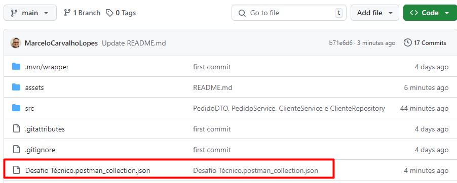
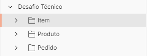

# Desafio Técnico - Desenvolver Full Stack
## Tecnologias utilizadas.

* Java 17
* Spring Boot 3.4.0
* JPA
* Bando de Dados H2

### Executando a API

### Clone o repositório

git clone https://github.com/MarceloCarvalhoLopes/pedrapido.git

Importar a aplicação na IDE de prefência e executar.

Importar a Collection -> Desafio Técnico, que está no projeto e testar os end-poinst disponíveis.

      

      

